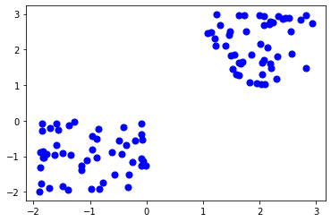
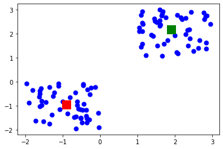

```python
import pandas as pd
import numpy as np
import matplotlib.pyplot as plt
from sklearn.cluster import KMeans
%matplotlib inline
```


```python
#Generate random data
X=-2*np.random.rand(100,2)

```


```python
X1=1+2*np.random.rand(50,2)
```


```python
X[50:100 , :] =X1
```


```python
plt.scatter(X[ :,0],X[ :,1],s=50,c='b')
plt.show
```


    <function matplotlib.pyplot.show(close=None, block=None)>





```python
Kmean=KMeans(n_clusters=2)
Kmean.fit(X)
```


    KMeans(n_clusters=2)


```python
KMeans(algorithm='auto',copy_x=True,init='k-means++',max_iter=300,n_clusters=2,n_init=10,n_jobs=1,precompute_distances='auto',random_state='None',tol=0.0001,verbose=0)
```


    KMeans(n_clusters=2, n_jobs=1, precompute_distances='auto', random_state='None')


```python
#to find the center of clusters
Kmean.cluster_centers_
```


    array([[ 1.89926827,  2.16265405],
           [-0.90092687, -0.94626826]])


```python
plt.scatter(X[:,0],X[:,1],s=50,c='b')
plt.scatter(1.89926827,  2.16265405 , s=200,c='g',marker='s')
plt.scatter(-0.90092687, -0.94626826,s=200,c='r',marker='s')
plt.show()
```





```python
#testing the algo
Kmean.labels_
```


    array([1, 1, 1, 1, 1, 1, 1, 1, 1, 1, 1, 1, 1, 1, 1, 1, 1, 1, 1, 1, 1, 1,
           1, 1, 1, 1, 1, 1, 1, 1, 1, 1, 1, 1, 1, 1, 1, 1, 1, 1, 1, 1, 1, 1,
           1, 1, 1, 1, 1, 1, 0, 0, 0, 0, 0, 0, 0, 0, 0, 0, 0, 0, 0, 0, 0, 0,
           0, 0, 0, 0, 0, 0, 0, 0, 0, 0, 0, 0, 0, 0, 0, 0, 0, 0, 0, 0, 0, 0,
           0, 0, 0, 0, 0, 0, 0, 0, 0, 0, 0, 0])


```python
sample_test=np.array([-3.0,-3.0])
second_test=sample_test.reshape(1,-1)
Kmean.predict(second_test)
```


    array([1])


#It shows that the test data point belongs to the 1 (red centroid) cluster


```python
sample_test=np.array([-5.0,-5.0])
third_test=sample_test.reshape(1,-1)
Kmean.predict(third_test)
```


    array([1])


```python
sample_test=np.array([-25.0,-25.0])
third_test=sample_test.reshape(1,-1)
Kmean.predict(third_test)
```


    array([1])


```python
sample_test=np.array([-1000.0,-1000.0])
third_test=sample_test.reshape(1,-1)
Kmean.predict(third_test)
```


    array([1])


```python
sample_test=np.array([5.0,5.0])
third_test=sample_test.reshape(1,-1)
Kmean.predict(third_test)
```


    array([0])


```python
sample_test=np.array([1000,1000])
third_test=sample_test.reshape(1,-1)
Kmean.predict(third_test)
```


    array([0])


```python

```
